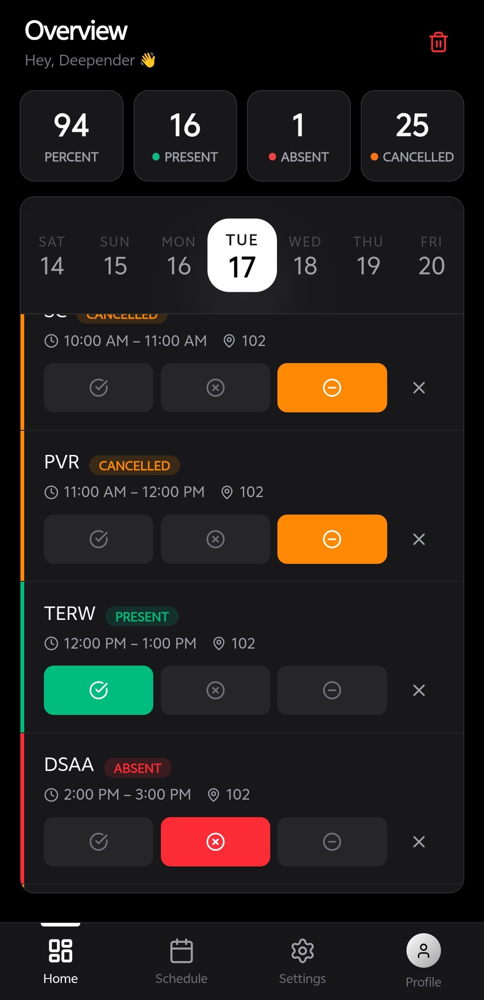
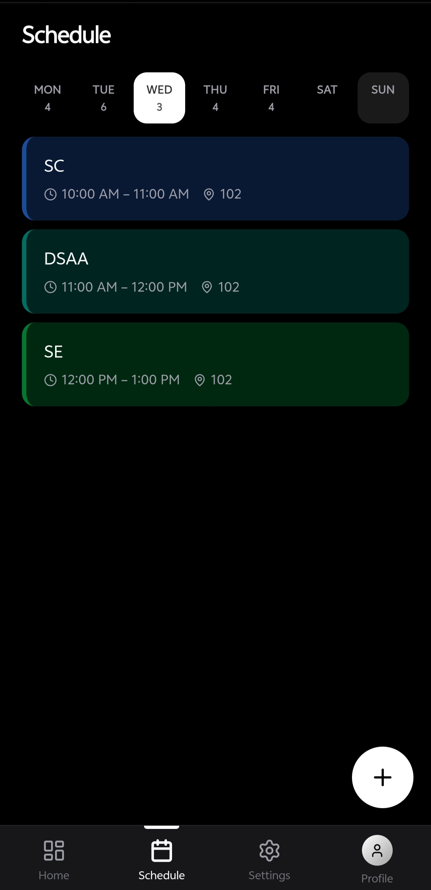
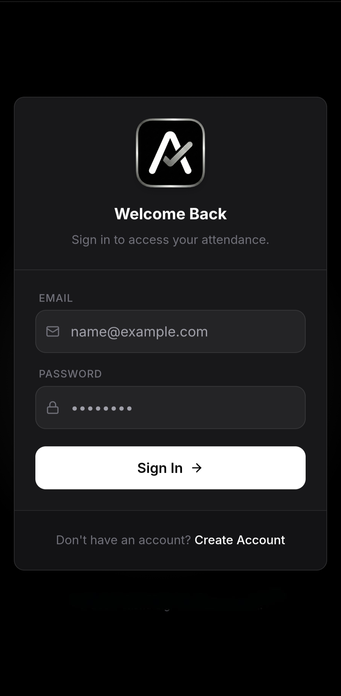

<div align="center">
  

  # 🎓 AI-Attendance (Attend-Sight)
  
  <p align="center">
    <b>A smart, AI-powered attendance tracking application built for the modern student.</b>
  </p>
  
  [](https://reactjs.org/)
  [](https://vitejs.dev/)
  [](https://tailwindcss.com/)
  [](https://ai.google.dev/)
</div>

<br />

## ✨ Overview

**AI-Attendance** (also known as *Attend-Sight*) is a comprehensive, mobile-first web application designed to help users effortlessly manage and track their class schedules and attendance records. By leveraging the power of Google's Gemini AI, the application can intelligently process and generate schedules from uploaded documents or text, saving you the hassle of manual data entry.

With a beautiful UI powered by TailwindCSS and Framer Motion, it offers a seamless experience tailored for both desktop and mobile devices.

---

## 📱 Mobile Experience

The application has been designed with a "Mobile-First" approach, ensuring a native-like app experience on smaller screens. 

<div align="center">
  <h3>Mobile App Views</h3>
  <table align="center">
    <tr>
      <td align="center">
        
        <br />
        <b>Dashboard & Overview</b>
      </td>
      <td align="center">
        
        <br />
        <b>Attendance Stats</b>
      </td>
      <td align="center">
        
        <br />
        <b>AI Schedule Upload</b>
      </td>
    </tr>
  </table>
</div>

---

## 🚀 Key Features

- **🤖 AI-Powered Schedule Upload:** Uses Google's Gemini API (`@google/genai`) to parse and generate accurate weekly schedules automatically.
- **📊 Real-time Statistics:** Visualizes attendance data with intuitive charts (via `recharts`), showing percentages for attended, missed, and cancelled classes.
- **🔐 Secure Authentication:** Seamless login and registration workflows implemented using JWT and `bcryptjs`.
- **🌙 Dark/Light Mode Support:** A fully adaptive theme context built for late-night study sessions.
- **📱 Fully Responsive UI:** Carefully crafted with Tailwind CSS to ensure a stellar mobile experience and a beautiful multi-column layout on desktops.
- **✨ Fluid Animations:** Smooth UI transitions and micro-interactions powered by `framer-motion`.

---

## 🛠️ Technology Stack

- **Frontend Framework:** React 19, React Router v7
- **Build Tool:** Vite
- **Styling:** Tailwind CSS v4, `clsx`, `tailwind-merge`
- **Animations & Icons:** Framer Motion, Lucide React
- **Data Visualization:** Recharts
- **AI Integration:** Google Gemini API (`@google/genai`)
- **Backend/API Simulation:** Express.js, Cors, Nodemailer

---

## 💻 Getting Started

Follow these steps to set up the project locally on your machine.

### Prerequisites

Ensure you have the following installed:
- [Node.js](https://nodejs.org/) (v16.x or newer recommended)
- `npm` or `yarn`

### Installation

1. **Clone the repository:**
   ```bash
   git clone https://github.com/yourusername/AI-Attendance.git
   cd AI-Attendance
   ```

2. **Install dependencies:**
   ```bash
   npm install
   ```

3. **Configure Environment Variables:**
   Create a `.env.local` file in the root of your project and configure your Gemini API key:
   ```env
   GEMINI_API_KEY=your_gemini_api_key_here
   ```
   > *Note: You can get your API key from [Google AI Studio](https://aistudio.google.com/).*

4. **Run the development server:**
   ```bash
   npm run dev
   ```

5. **Open the application:**
   Navigate to `http://localhost:5173` in your browser.

---

## 📁 Project Structure

```text
AI-Attendance/
├── api/                  # API handlers and server logic
├── components/           # Reusable UI components (Buttons, Stats, Upload)
├── context/              # Global state management (Auth, Theme)
├── design-system/        # UI and styling foundations
├── pages/                # Page views (Dashboard, Login, Settings, Schedule)
├── public/               # Static assets
├── server/               # Express backend files
├── utils/                # Helper functions
└── package.json          # Project configuration and dependencies
```

---

## 🤝 Contributing

Contributions are always welcome! If you have any ideas to improve the app or find a bug, feel free to open an issue or submit a pull request.

1. Fork the Project
2. Create your Feature Branch (`git checkout -b feature/AmazingFeature`)
3. Commit your Changes (`git commit -m 'Add some AmazingFeature'`)
4. Push to the Branch (`git push origin feature/AmazingFeature`)
5. Open a Pull Request

---

<div align="center">
  <i>Built with ❤️ for hassle-free attendance tracking.</i>
</div>
